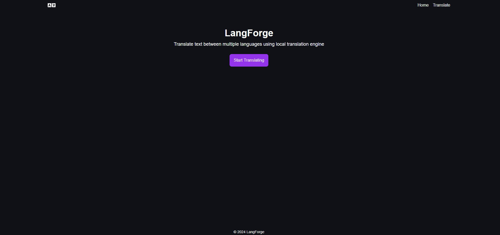
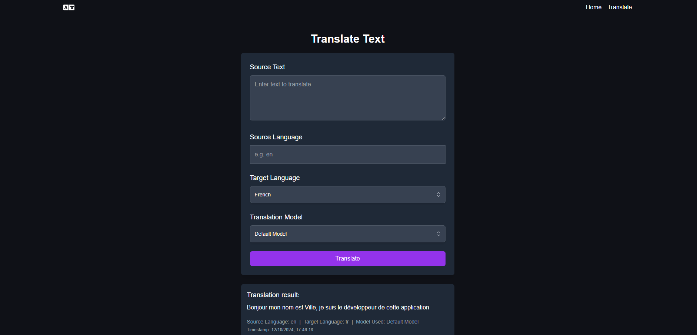

**LangForge** employs state-of-the-art language models fine-tuned specifically for translation tasks, this ensures that translations are not only accurate but also contextually relevant.

Supports now multiple source and target languages, check the list for the language codes.

## Core Features
- **Wide Language Range:** Supports major global languages incl. Russian, Chinese, Hindi and Arabian
- **High Accuracy:** Delivers precise translations by leveraging advanced machine learning techniques
- **Automatic Language Detection:** Intelligently detects the source language of the input text
- **Context Awareness:** Understands and maintains the context of the source material

## Technology Stack
- SQL Alchemy
- Typescript
- Javascript
- Next.JS
- FastAPI
- Python
- SQLite

## Language Codes
- Romanian (ro)
- German (de)
- Spanish (es)
- Chinese (zh)
- Arabian (ar)
- Russian (ru)
- Finnish (fi)
- French (fr)
- Italian (it)
- Hindi (hi)

## Preview Images




## How to Run

### Environment Variables
Add the following lines to `.env` file (backend):

```
DATABASE_URL=langforge.db
LOG_LEVEL=INFO

MODEL_EN_ES=Helsinki-NLP/opus-mt-en-es
MODEL_EN_FR=Helsinki-NLP/opus-mt-en-fr
MODEL_EN_DE=Helsinki-NLP/opus-mt-en-de
MODEL_EN_IT=Helsinki-NLP/opus-mt-en-it
MODEL_EN_ZH=Helsinki-NLP/opus-mt-en-zh
MODEL_EN_RU=Helsinki-NLP/opus-mt-en-ru
MODEL_EN_AR=Helsinki-NLP/opus-mt-en-ar
MODEL_EN_HI=Helsinki-NLP/opus-mt-en-hi
MODEL_EN_FI=Helsinki-NLP/opus-mt-en-fi
MODEL_EN_RO=Helsinki-NLP/opus-mt-en-ro

MODEL_FR_EN=Helsinki-NLP/opus-mt-fr-en
MODEL_ES_EN=Helsinki-NLP/opus-mt-es-en
MODEL_IT_EN=Helsinki-NLP/opus-mt-it-en
MODEL_DE_EN=Helsinki-NLP/opus-mt-de-en
MODEL_AR_EN=Helsinki-NLP/opus-mt-ar-en
MODEL_RU_EN=Helsinki-NLP/opus-mt-ru-en
MODEL_ZH_EN=Helsinki-NLP/opus-mt-zh-en
MODEL_HI_EN=Helsinki-NLP/opus-mt-hi-en
MODEL_FI_EN=Helsinki-NLP/opus-mt-fi-en
```

Add the following line to `.env.local` file (frontend):
<br/>
`NEXT_PUBLIC_API_URL=http://localhost:8000/api/v1`

### Backend
1. Install Dependencies
   - `pip install -r requirements.txt`
2. Navigate to Backend Dir
   - `cd backend`
3. Run the Backend
   - `uvicorn app.main:app --reload`
### Frontend
1. Navigate to Frontend Dir
   - `cd frontend`
2. Install Dependencies
   - `npm install`
3. Run the Backend
   - `npm run dev`
  
## Support
If you would like to support the development of LangForge, consider donating or sponsoring the project.

[Buy Me a Coffee](https://www.buymeacoffee.com/pavi103)
<br/>
<br/>
[Ko-fi](https://ko-fi.com/pavi103)

## Author
- @vpakarinen
